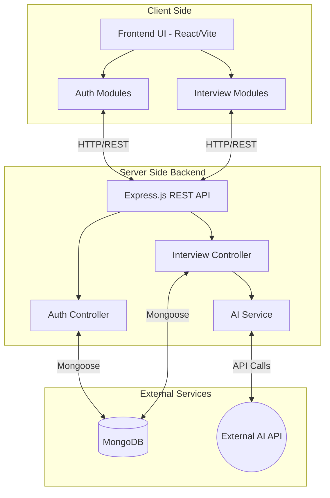

# Resume AI 🚀

Resume AI is a full-stack web application designed to help job seekers prepare for interviews through AI-powered mock interviews and feedback. By leveraging a modern tech stack and Artificial Intelligence, the platform provides tailored interview questions and detailed performance reports.

## 🏗 Architecture Diagram



## ✨ Features

- **User Authentication**: Secure signup and login functionality using JSON Web Tokens (JWT) and robust password hashing.
- **AI-Driven Interviews**: Dynamically generated mock interview sessions tailored to user profiles and resumes.
- **Performance Reports**: Detailed post-interview feedback and analytics stored in the database for continuous improvement.
- **Responsive UI**: A clean, modern interface built with React and custom SCSS styling.

## 🛠 Tech Stack

**Frontend:**
- [React](https://reactjs.org/) (bootstrapped with [Vite](https://vitejs.dev/))
- React Router DOM
- SCSS for styling

**Backend:**
- [Node.js](https://nodejs.org/) & [Express.js](https://expressjs.com/)
- [MongoDB](https://www.mongodb.com/) (Mongoose ORM)
- JSON Web Tokens (JWT) for Authentication
- External AI Provider Integration

## 📂 Project Structure

```text
resume-ai/
├── Backend/
│   ├── src/
│   │   ├── config/          
│   │   ├── controllers/     
│   │   ├── middlewares/     
│   │   ├── models/          
│   │   ├── routes/          
│   │   └── services/        
│   ├── server.js            
│   └── package.json
└── Frontend/
    ├── src/
    │   ├── features/        
    │   ├── style/           
    │   ├── App.jsx          
    │   ├── app.routes.jsx   
    │   └── main.jsx         
    ├── vite.config.js       
    └── package.json
```

## 🚀 Getting Started

### Prerequisites

- [Node.js](https://nodejs.org/) (v16 or higher)
- [MongoDB](https://www.mongodb.com/) (Local instance or MongoDB Atlas)
- An API Key for the configured AI Service

### 1. Clone the repository

```bash
git clone <repository-url>
cd resume-ai
```

### 2. Backend Setup

Open a new terminal window and navigate to the Backend directory:

```bash
cd Backend
npm install
```

Create a `.env` file in the `Backend` directory and add the following variables:

```env
PORT=3000
MONGODB_URI=your_mongodb_connection_string
JWT_SECRET=your_jwt_secret_key
AI_API_KEY=your_ai_service_api_key
```

Start the backend server:

```bash
npm run dev
```

### 3. Frontend Setup

Open another terminal window and navigate to the Frontend directory:

```bash
cd Frontend
npm install
```

Create a `.env` file in the `Frontend` directory:

```env
VITE_API_BASE_URL=http://localhost:3000/api
```

Start the Vite development server:

```bash
npm run dev
```

## 🔒 Security & Best Practices

- **Token Blacklisting**: Implemented token invalidation upon logout to prevent replay attacks.
- **Protected Routes**: Frontend routes are wrapped in a `<Protected>` component, and backend endpoints use authentication middleware.
- **File Uploads**: Safe file handling managed via dedicated middleware.

## 🤝 Contributing

Contributions, issues, and feature requests are welcome! Feel free to check the issues page.
